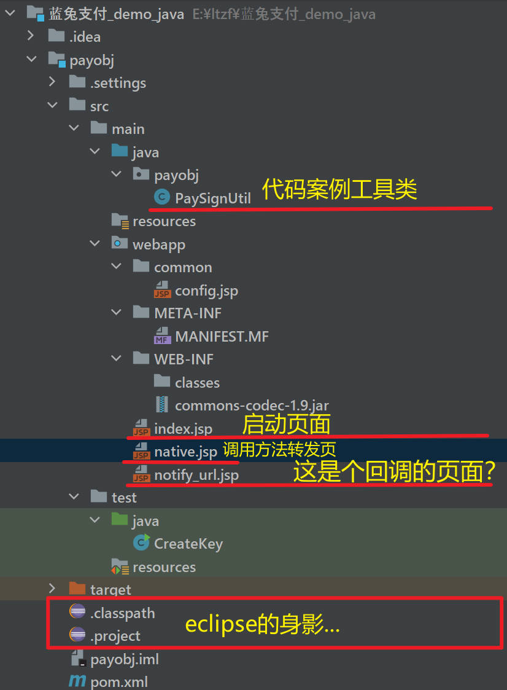
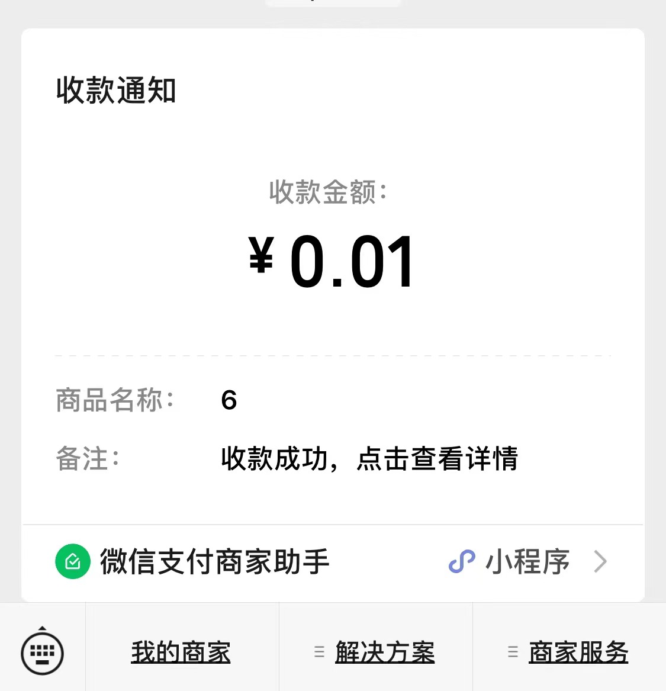

# 蓝兔支付对接-下篇

上一篇我们知道了 API 文档地址 👉️[蓝兔支付 API 文档](https://www.ltzf.cn/?invite=ubvuhi)，并且应下载了对应语言包的案例 👉️[蓝兔支付 Demo 案例](https://www.ltzf.cn/?invite=ubvuhi)

行，那我们下面就来瞅瞅他的代码是怎么个事儿？！

页面短小而精悍，对于我这个搞后端的来说，一半蒙一半疑问，不过应该也明白个大概了：

这个 Demo 应该就是需要启动，然后在页面`输入`啥啥啥，再点击`发送`，应该大概可能就是发送到他们的代理地址了，然后他们的服务调微信的接口，就成功了...🤔

行行行，连个常见的 sdk 包都没有，这样玩儿是吧，行行，那就整呗，把你启动起来看看啥样。

所以后面我们主要分为几个步骤来进行：

1. 启动这个 demo 项目
2. 页面与代码做对比，看看要怎么做
3. 调试验证

## 一、启动项目

启动项目这个还真弄了一会儿了，现在大家都是各种 SpringBoot、各种 SpringCloud 是吧？然后在某个 Application 中的 main 方法里，点击`run`就起飞了，这突然间来一个 jsp 的代码 demo,这怎么启动？我直接点击 IDEA 上的浏览器图标？提示我

哦豁，这怎么办?我记得当年我就是这样的呀！！一点这个图标就弹出页面的框框了。

难道我要下载一个多年以前经常手启的一个东西，叫做 tomcat，行，我配置一下。

apply——>ok——>点小`绿色三角`run 起来！期待...

果然可以，浏览器上显示的是这样了，说明启动成功。那我们先赶紧发个请求试试，先不看什么代码，show me show-how。

## 二、页面---代码调参

在页面上输入参数，经过我的踩坑，可用我的参数来测试

商户订单号：要求 6 位以上，那就天 6 个 6

支付金额：0.01

商品描述：接着 6

然后点击`支付`

走着！

走着走着你就会遇到各种小问题，注意，是小问题，下面我列出我见过的问题供君参考

前提需要在`config.jsp`中需要`配置`三个参数。值和我的【蓝兔支付对接-上篇】文章介绍的一样。

报错 1： 返回失败：发起 ip 不在白名单，请添加到白名单后再调用接口

解决办法：还记得上篇中的`商户管理`吗？👉️[蓝兔支付](https://www.ltzf.cn/?invite=ubvuhi) 在里面需要配置`白名单域名`(配示例的就行)和`白名单IP`(公网 IP)，要不然微信不知道往哪里给你返回支付的二维码，都要在公网中才可以找到你的电脑。

公网 IP 获取小技巧：百度——>输入 IP——>选择一个`IP地址查询xxxx`的网站，会显示你的公网 IP。

报错 2： 返回失败：notify_url 不在白名单，请添加到白名单后再调用接口

解决办法：把文档中的这个地址`https://www.weixin.qq.com/wxpay/pay.php` 配置到`白名单域`中

报错 3： 返回失败：参数 notify_url 格式错误

不要怀疑，肯定是刚才说 config 里面的参数中 notify_url 没配置好，参考我的`https://www.weixin.qq.com/wxpay/pay.php`改一下就好了。

## 三、调试验证

上面的问题你都过五关斩六将的解决了，那么好，接下来就是见证奇迹的时刻！

显示了二维码，给自己支付一分钱，则收款成功。

OK，完事儿咯，大家可以试一试，有问题可私信沟通哈。

