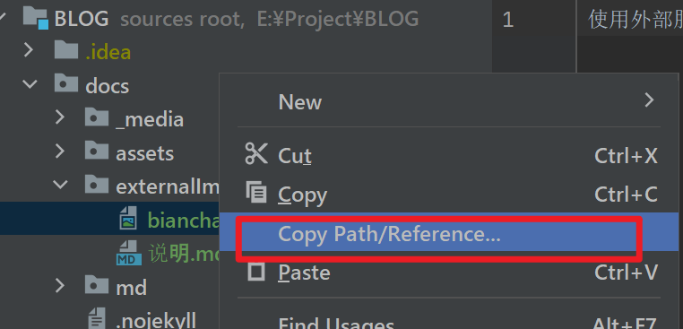

引用图片说明：
使用外部服务引入图片时，直接复制相对路径(Copy Path/Reference..)，
例：
docs/externalImages/bianchang15cm.jpg ，
并不带"docs"，
然后再加上gitHub名称：https://baneryuezai.github.io  
即：
然后在路径中：https://baneryuezai.github.io/externalImages/bianchang15cm.jpg，将".io/"后面替换掉。不带"docs"
